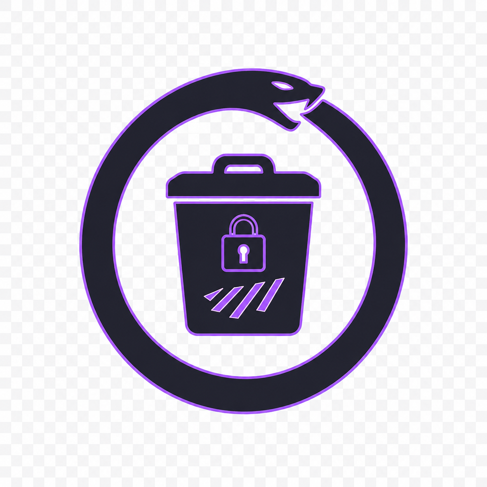
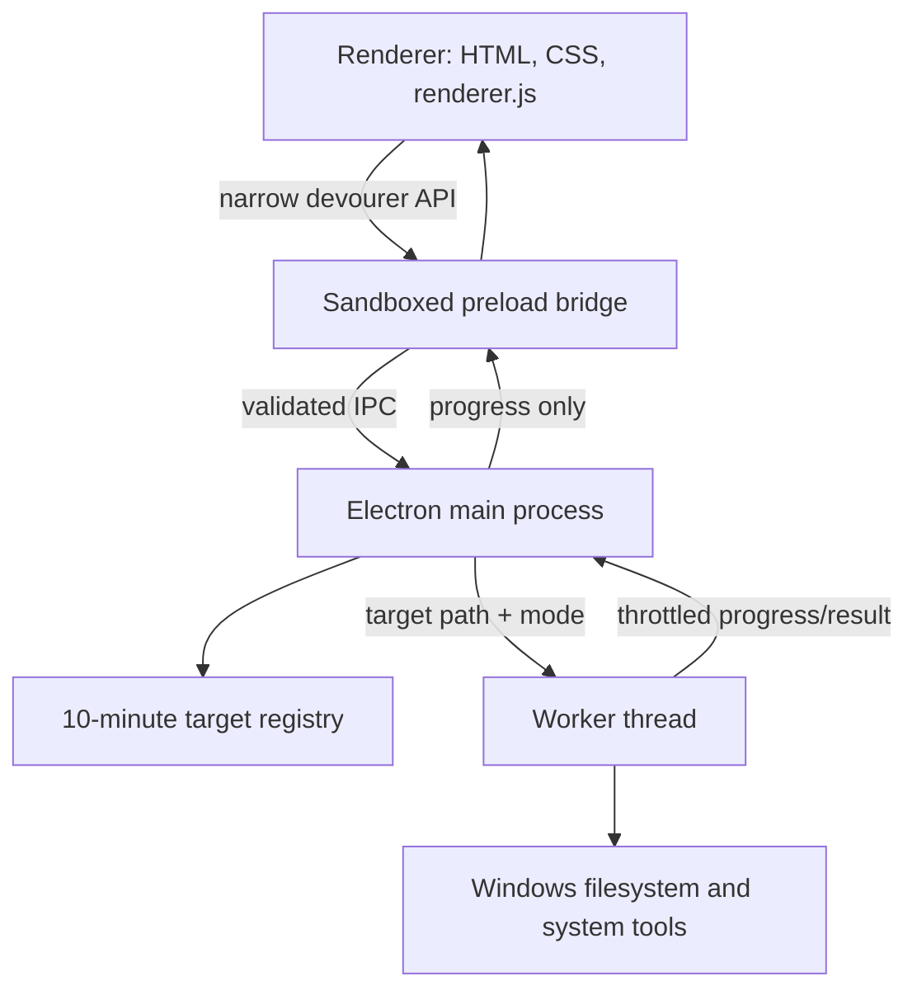

<p align="center">
  
</p>

<h1 align="center">The Devourer</h1>

<p align="center">
  A focused Windows utility for best-effort, multi-pass local file shredding.
</p>

<p align="center">
  
  
  
  
</p>

The Devourer overwrites a file's primary data and NTFS alternate data streams,
randomizes its namespace, clears common metadata, flushes writes, and removes
the final filesystem entry. It packages this pipeline in a small, animated,
portable Electron application with live progress and explicit storage-risk
warnings.

> [!WARNING]
> Deletion is permanent. The Devourer is a **best-effort file shredder**, not a
> universal forensic-erasure guarantee. Read [Security model and limitations](#security-model-and-limitations)
> before using it for sensitive data.

## Contents

- [Features](#features)
- [Requirements](#requirements)
- [Quick start](#quick-start)
- [Secure modes](#secure-modes)
- [How deletion works](#how-deletion-works)
- [Security architecture](#security-architecture)
- [Security model and limitations](#security-model-and-limitations)
- [Configuration](#configuration)
- [Development](#development)
- [Testing](#testing)
- [Building a release](#building-a-release)
- [Diagnostics and troubleshooting](#diagnostics-and-troubleshooting)
- [Project structure](#project-structure)
- [License](#license)

## Features

- Four overwrite passes for the main file stream and every detected NTFS
  alternate data stream: `0x00`, `0xFF`, cryptographically secure random data,
  then `0x00`.
- File-picker and drag-and-drop workflows.
- Three deletion modes: Normal, Aggressive, and Extreme.
- SSD/NVMe, TRIM, BitLocker, and Volume Shadow Copy risk checks.
- Reparse-point, symbolic-link, hard-link, and exclusive-lock guards.
- Random 64-character hexadecimal renaming before deletion.
- Best-effort timestamp clearing and Windows Recent shortcut cleanup.
- Worker-thread shredding with throttled live progress updates.
- Sandboxed Electron renderer with context isolation and a narrow preload API.
- Portable Windows x64 build; no installer required.
- No application telemetry, account, cloud service, or runtime network API.

## Requirements

### Running the app

- Windows 10 or Windows 11, x64.
- Local filesystem access to the target file.
- Administrator access only for Aggressive and Extreme modes.

The current packaged target is Windows x64. Directories, symbolic links,
Windows reparse points, and files with multiple hard links are intentionally
rejected.

### Building from source

- Node.js 22.12 or newer.
- npm.
- Windows x64 for producing and executing the portable build.

## Quick start

1. Download `The-Devourer-1.0.2-portable-x64.exe` from the repository's
   Releases page.
2. Run the executable. It extracts to a temporary directory and opens the app;
   it does not install a permanent system service.
3. Choose a secure mode.
4. Click the bin to open the file picker, or drag one file onto the window.
5. Review the target name, mode, and permanent-delete warning.
6. Click the armed bin again to begin deletion.
7. Keep the app open until it reports `100%` and shows the completion state.

The renderer receives a short-lived target ID and shortened display path. The
full filesystem path remains in the Electron main process.

## Secure modes

| Mode | Operations | Administrator required | Expected cost |
|---|---|---:|---|
| **Normal** | Four-pass stream wipe, metadata cleanup, truncate, flush, unlink | No | Proportional to file size |
| **Aggressive** | Normal mode plus Windows volume ReTrim | Yes | Normal cost plus volume optimization |
| **Extreme** | Aggressive mode plus same-volume free-space filling | Yes | Potentially very slow; can write most available free space |

Selecting Aggressive or Extreme without administrator rights opens a Windows
elevation prompt. The app restarts with `--secure-mode=<mode>` after approval;
the target must then be selected again.

Extreme mode preserves approximately 512 MiB of free space. It writes random
data into temporary files of up to 256 MiB each, flushes them, and removes the
temporary wipe directory when finished or interrupted by an error.

## How deletion works

```mermaid
flowchart LR
    U["User selects or drops a file"] --> R["Main process registers target ID"]
    R --> G["Link, type, and lock guards"]
    G --> S["Storage risk checks"]
    S --> A["Enumerate and wipe NTFS ADS"]
    A --> N["Randomize name and relocate"]
    N --> W["Four-pass primary-stream overwrite"]
    W --> M["Truncate, clear timestamps, flush"]
    M --> D["Unlink final namespace entry"]
    D --> X["Optional ReTrim / free-space wipe"]
    X --> C["Completion plus warnings"]
```



### Detailed pipeline

| Stage | What happens |
|---|---|
| Target inspection | `lstat` rejects symbolic links; Windows attributes reject reparse points; `stat` rejects non-files and files with more than one hard link. |
| Storage analysis | The app queries drive media/bus type, TRIM state, BitLocker state, and Volume Shadow Copies. Failures become warnings rather than silently claiming safety. |
| Attribute cleanup | Windows file attributes are reset to `Normal`; a writable-mode fallback is used if PowerShell fails. |
| Exclusive lock check | A read/write handle is opened with `FileShare.None`. Files held by another process are rejected before destructive work begins. |
| ADS enumeration | PowerShell `Get-Item -Stream *` discovers named NTFS alternate data streams. |
| ADS overwrite | Every named stream is overwritten with four passes, truncated, flushed, closed, and removed. |
| Namespace randomization | The original filename is replaced with a cryptographically random 64-character hexadecimal name. |
| Timestamp cleanup | Creation, last-write, and last-access times are set to the Unix epoch. If creation-time editing fails, the app falls back to access/write timestamps and reports a warning. |
| Temporary relocation | The randomized file is moved to `%TEMP%` when a same-volume rename is possible. Cross-volume failure is non-fatal; wiping continues under the randomized local name. |
| Primary overwrite | The file is written in 1 MiB chunks using zero, ones, CSPRNG, and final-zero passes. Every pass is followed by `fsync`. |
| Final removal | The stream is truncated to zero bytes, timestamps are cleared again, metadata is flushed, the handle is closed, and the file is unlinked. |
| Artifact cleanup | Matching Windows Recent `.lnk` shortcuts are removed on a best-effort basis. |
| Optional volume work | Aggressive mode invokes `Optimize-Volume -ReTrim`. Extreme mode additionally fills same-volume free space while preserving a 512 MiB reserve. |

### Overwrite pattern

| Pass | Data | Purpose |
|---:|---|---|
| 1 | `0x00` | Deterministic full-stream overwrite |
| 2 | `0xFF` | Opposite deterministic bit pattern |
| 3 | CSPRNG bytes | Unpredictable overwrite generated by Node.js `crypto.randomBytes` |
| 4 | `0x00` | Final deterministic state before truncation |

Four passes do not defeat SSD wear leveling, controller remapping, snapshots,
or external copies. They are a defense-in-depth strategy for addressable file
content, especially on conventional magnetic storage.

## Security architecture



### Electron process boundary

The main window uses:

- `contextIsolation: true`
- `nodeIntegration: false`
- `sandbox: true`
- a local `file://` page
- exact local base-URL validation for every IPC handler

The preload script exposes only the operations required by the UI. The
renderer has no general Node.js or filesystem access.

### Target registry

After a file is selected or dropped, the main process stores its resolved path
in an in-memory registry and returns a random UUID, basename, size, and shortened
display path. Registry entries expire after ten minutes and are consumed when
deletion starts. A stale, reused, or unknown ID is rejected.

### Preload API

| Method | Purpose |
|---|---|
| `pickFile()` | Opens the native one-file picker and registers the result. |
| `resolvePath(filename)` | Opens a native picker when a dropped browser `File` cannot provide a usable path. |
| `registerDroppedFile(file)` | Resolves a dropped file through Electron `webUtils`, then registers it in the main process. |
| `shredFile(targetId, options)` | Consumes a registered target and starts the worker with the selected mode. |
| `getStartupSecureMode()` | Reads the validated `--secure-mode` startup value. |
| `requestSecureMode(mode)` | Applies a mode or requests an elevated restart. |
| `onProgress(callback)` | Subscribes to structured progress events and returns an unsubscribe function. |
| `minimizeWindow()` / `closeWindow()` | Controls the frameless application window. |

Only one shred worker can run at a time. Worker progress messages are throttled
to at most one update every 50 ms within the same phase, while phase changes
are delivered immediately.

### Runtime recovery and diagnostics

The main process records renderer, GPU/child-process, window-close, minimize,
and quit lifecycle events. If the renderer exits abnormally, the window is
reloaded. After deletion completes, a minimized or hidden window is restored
so completion cannot silently disappear.

Diagnostic log:

```text
%APPDATA%\the-devourer\devourer.log
```

The log contains lifecycle state only; it does not record deleted file paths.

## Security model and limitations

The Devourer reduces recoverable data from the file's normal filesystem
namespace and addressable streams. It cannot guarantee physical erasure across
every storage, operating-system, backup, and synchronization layer.

### What it protects against

- Casual recovery from an ordinarily deleted filesystem entry.
- Recovery of addressable primary-stream content that was successfully
  overwritten.
- Overlooked data in named NTFS alternate data streams.
- Accidental shredding through symbolic links, reparse points, or one name of a
  multiply hard-linked file.
- Starting a destructive operation on a file currently locked by another
  process.

### What it cannot reliably erase

- SSD/NVMe wear-leveling cells and controller-remapped blocks.
- Drive firmware caches and inaccessible spare areas.
- Windows Volume Shadow Copies and restore snapshots.
- NTFS MFT history, USN journal records, and other filesystem metadata history.
- Backups, cloud-sync replicas, version history, remote copies, or removable
  media copies.
- Search indexes, antivirus records, shell history, thumbnails, application
  logs, or third-party telemetry.
- Cloud-only placeholders and virtual files that do not map to a normal local
  file stream.
- Data already copied into RAM, swap/page files, hibernation files, or crash
  dumps.

For highly sensitive data, enable full-disk encryption **before** creating the
file, control backups and replicas, then destroy the encryption key or sanitize
the entire device according to an appropriate organizational standard.

## Storage checks and warnings

The app performs these checks before overwriting:

| Check | Implementation | Warning condition |
|---|---|---|
| Media type | `Get-Partition` + `Get-Disk` | SSD/NVMe detected, unknown media, or query unavailable |
| TRIM | `fsutil behavior query DisableDeleteNotify` | TRIM enabled on storage not already classified as flash, or status unavailable |
| BitLocker | `manage-bde -status <drive>:` | Full-volume encryption and protection cannot both be confirmed |
| Shadow copies | `vssadmin list shadows /for=<drive>:` | One or more snapshots exist, or status cannot be queried |

Warnings do not cancel the operation. They are displayed after completion so
the result does not imply stronger erasure than the storage stack can support.

## Configuration

### Command-line options

| Option | Values | Description |
|---|---|---|
| `--secure-mode=<mode>` | `normal`, `aggressive`, `extreme` | Sets the startup mode. Invalid values fall back to Normal. |
| `--dev` | flag | Preserved when restarting the development app with elevation. |
| `--smoke-test` | flag | Internal packaged-build validation; opens a hidden window, validates security/UI/IPC, then exits. |

### Environment variables

| Variable | Value | Effect |
|---|---|---|
| `DEVOURER_ENABLE_RETRIM` | `1` | Forces ReTrim independently of the selected preset. |
| `DEVOURER_FREE_SPACE_WIPE` | `1` | Forces same-volume free-space wiping independently of the selected preset. |
| `DEVOURER_IMPORT_ONLY` | `1` | Internal test harness switch that imports the main module without booting the app. |

The environment overrides are intended for controlled development and testing.
Normal users should select a mode through the interface.

## Development

```powershell
npm install
npm start
```

Use `npm run dev` to preserve the development flag across an elevated restart.

### npm scripts

| Command | Purpose |
|---|---|
| `npm start` | Launch the application. |
| `npm run dev` | Launch with `--dev`. |
| `npm run check` | Syntax-check production and release-test JavaScript files. |
| `npm run test:unit` | Run shredder and worker tests with Node's built-in test runner. |
| `npm run test:e2e` | Launch a hidden real Electron window and test security settings, preload IPC, an actual 8 MiB deletion, completion, and UI reset. |
| `npm test` | Run unit and Electron end-to-end tests. |
| `npm run dist:win` | Build the portable Windows x64 executable. |
| `npm run test:package` | Verify artifact freshness/size and run the packaged executable's smoke test. |
| `npm run release:verify` | Run syntax checks, all tests, build, and packaged smoke validation. |

## Testing

The automated suite covers:

- normal file overwrite and deletion;
- directory rejection;
- hard-link rejection;
- symbolic-link rejection;
- read-only attribute clearing;
- NTFS alternate data stream wiping;
- worker-thread deletion and progress phases;
- BrowserWindow security preferences;
- preload API availability and trusted IPC;
- pre-delete warning visibility;
- actual 8 MiB renderer-to-IPC-to-worker deletion;
- post-delete completion and idle reset;
- packaged portable startup and internal smoke validation.

Run the full source test gate:

```powershell
npm test
```

## Building a release

Build the portable executable:

```powershell
npm run dist:win
```

Output:

```text
artifacts\The-Devourer-<version>-portable-x64.exe
```

Run the complete release gate:

```powershell
npm run release:verify
```

The build uses maximum ASAR compression and includes only the runtime source,
assets, README, license, and package metadata listed in `package.json`.

### Release checklist

- Update `version` in `package.json` and `package-lock.json`.
- Run `npm run release:verify`.
- Manually shred a disposable file on Windows.
- Confirm the pre-delete best-effort warning remains visible.
- Confirm completion remains visible and the app resets to idle.
- Publish the portable executable with this README and the security limitations
  intact.

## Diagnostics and troubleshooting

| Symptom | Cause / action |
|---|---|
| `target is locked by another process` | Close the editor, media player, sync client, or other process holding the file, then select it again. |
| `target has ... hard links` | Remove other hard links first. The app refuses to shred only one name while the same file data remains reachable elsewhere. |
| Symbolic-link or reparse-point rejection | Select the real regular file. Namespace indirection is deliberately not followed. |
| SSD, TRIM, BitLocker, or snapshot warnings | Read the warning literally; the file was processed, but old data may remain outside the addressable stream. |
| Aggressive/Extreme mode returns to Normal | Approve the Windows elevation prompt, then reselect the target after restart. |
| Extreme mode takes a long time | It may write nearly all available free space on the target volume. Use Normal or Aggressive unless free-space filling is specifically required. |
| Window seems to disappear after deletion | Use the latest build. Completion now restores hidden/minimized windows. Inspect `%APPDATA%\the-devourer\devourer.log` for lifecycle events. |
| Portable build reports `Can't open output file` | Close any running copy of that portable version, remove the old artifact, or increment the version before rebuilding. |
| Package smoke says artifact is stale | Re-run `npm run dist:win` after the last packaged-source change. |

## Privacy

The runtime app does not implement telemetry, analytics, accounts, remote
storage, automatic uploads, or an update service. File contents are processed
locally. Windows, security software, storage firmware, sync tools, and other
software may still create independent logs or copies outside the app's control.

## Project structure

```text
.
├── assets/
│   ├── icon.png                 # Windows application icon
│   └── readme-logo.png          # README hero artwork
├── test/
│   ├── electron-smoke.js        # Real Electron IPC/UI/delete E2E test
│   ├── package-smoke.js         # Portable artifact validation
│   ├── shredder.test.js         # Core shredder tests
│   └── worker.test.js           # Worker/progress integration test
├── index.html                   # Application markup and SVG artwork
├── styles.css                   # Window layout, state visuals, animation
├── renderer.js                  # UI state machine and interactions
├── preload.js                   # Sandboxed renderer IPC bridge
├── main.js                      # Window, target registry, IPC, elevation
├── shredder-worker.js           # Worker entry point and progress throttle
├── shredder.js                  # Secure-delete pipeline
├── package.json                 # Scripts and Electron Builder config
├── README.md
└── LICENSE
```

## Contributing

Changes to deletion semantics must include focused tests and preserve the
best-effort wording. Before opening a pull request:

```powershell
npm run check
npm test
```

For packaging changes, also run:

```powershell
npm run release:verify
```

Never weaken link, lock, sender-validation, sandbox, or warning behavior merely
to make an unsupported target succeed.

## License

The Devourer is available under the [MIT License](LICENSE).
